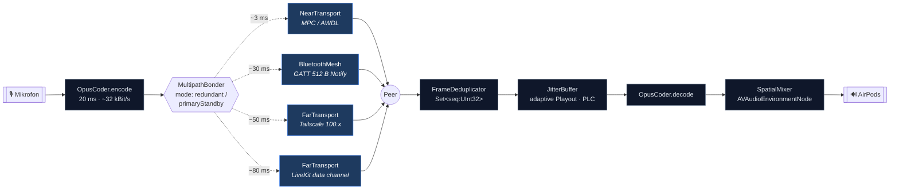
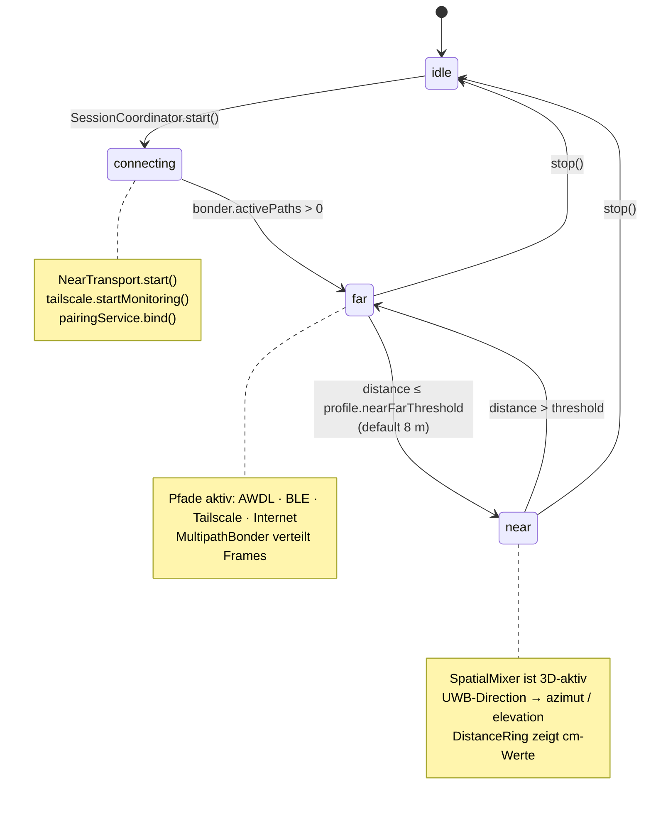
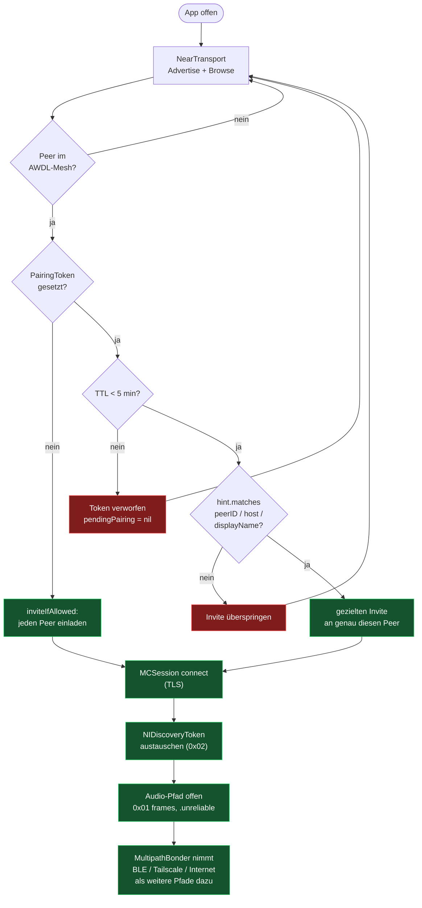
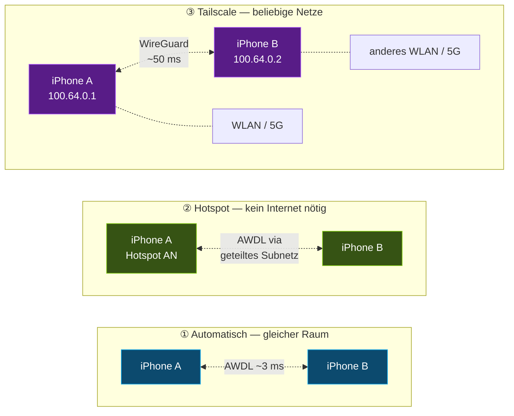
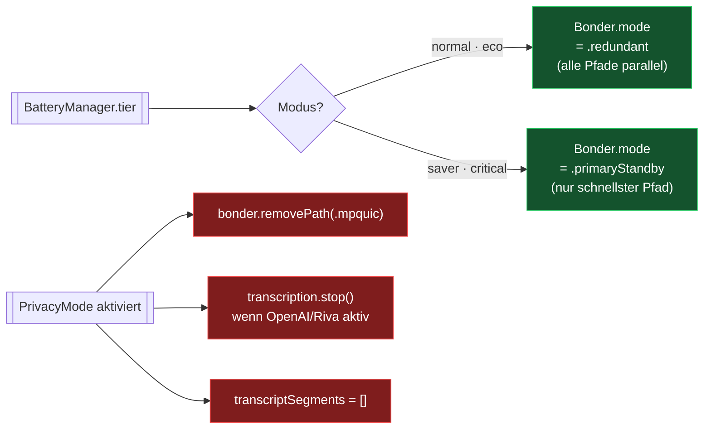
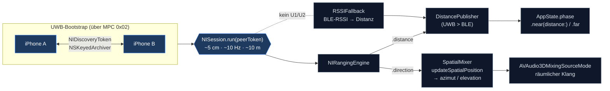

<div align="center">

# 〰 SONAR

**Räumliche Echtzeit-Audiokommunikation für iPhone**  
Spatial audio · Ultra-Wideband ranging · Multipath mesh · AI transcription

[](https://swift.org)
[](https://developer.apple.com/ios/)
[](https://developer.apple.com/xcode/)
[](#tests)
[](#latency-budget)

---

*Öffne Sonar auf zwei iPhones — die Verbindung baut sich automatisch auf.*

</div>

---

## Quick Start

```
Drop the IPA into SideStore  →  scan QR-Code from the other phone  →  talk.
```

1. `Sonar-unsigned-iOS26.ipa` (im Repo-Root) auf beide iPhones via SideStore sideloaden.
2. Sonar auf beiden Geräten öffnen.
3. Auf Gerät A: TopBar → **Verbinden** → **Anzeigen** (QR wird gerendert).
4. Auf Gerät B: TopBar → **Verbinden** → **Scannen** → QR von Gerät A scannen.
5. Reden.

Bonjour/AWDL findet Peers in den meisten Fällen automatisch — QR ist nur für Spezialfälle nötig (laute Umgebung mit vielen Sonar-Geräten, Tailscale-Setup, BLE-Erstkontakt). Details: [`docs/pairing.md`](docs/pairing.md).

---

## Was ist Sonar?

Sonar überträgt Sprache in Echtzeit zwischen zwei iPhones — mit **räumlichem Klang**, der sich an den tatsächlichen Abstand und die Richtung deines Gegenübers anpasst. Das Mikrofon des anderen klingt so, als käme es wirklich von dort, wo die Person steht.

Sonar kombiniert dafür mehrere Apple-Technologien zu einer Einheit:

| Technologie | Wofür | Reichweite |
|---|---|---|
| MultipeerConnectivity / AWDL | Lokale Direktverbindung (wie AirDrop) | ~30 m |
| CoreBluetooth GATT | Bluetooth-Fallback | ~10 m |
| NearbyInteraction (UWB) | Zentimetergenaue Entfernung + Richtung | ~10 m |
| LiveKit WebRTC | Internet-Pfad via `FarTransport` data channel | global |
| SFSpeechRecognizer | Live-Transkription, on-device | lokal |
| AVAudioEngine + VoiceProcessing | Spatial Mixer, AEC, Rauschunterdrückung | lokal |
| Opus | Audio-Codec (32 kBit/s, ±20 ms Frames) | — |

---

## Systemarchitektur

```
╔═════════════════════════════════════════════════════════════════════╗
║                     SONAR – SYSTEMÜBERBLICK                        ║
╚═════════════════════════════════════════════════════════════════════╝

  ┌─ SEND CHAIN ────────────────────────────────────────────────────┐
  │                                                                 │
  │  Mikrofon → AVAudioEngine (VoiceProcessing tap)                 │
  │      │                                                          │
  │      ├──► PreCaptureBuffer   [500ms Ringpuffer]                 │
  │      ├──► WakeWordDetector   ["Hey Sonar" Energie-Heuristik]   │
  │      ├──► VAD                [Sprachaktivität → MusicDucker]   │
  │      ├──► SmartMuteDetector  [Auto-Stummschaltung]             │
  │      ├──► LiveTranscription  [SFSpeechRecognizer on-device]    │
  │      ├──► LocalRecorder      [.sonsess Dateien]                │
  │      └──► OpusCoder.encode() [~32 kBit/s, FEC optional]       │
  │                  │                                              │
  │                  ▼                                              │
  │          MultipathBonder                                        │
  │        ┌──────────────────────────────────────┐                │
  │        │  NearTransport    │  FarTransport    │                │
  │        │  (MPC / AWDL)     │  (LiveKit data)  │                │
  │        └──────────────────────────────────────┘                │
  │        ┌──────────────────────────────────────┐                │
  │        │  BluetoothMeshTransport (GATT BLE)   │                │
  │        └──────────────────────────────────────┘                │
  └─────────────────────────────────────────────────────────────────┘

  ┌─ RECEIVE CHAIN ─────────────────────────────────────────────────┐
  │                                                                 │
  │  Transports → FrameDeduplicator → JitterBuffer                  │
  │      │                               [adaptive Playout, PLC]   │
  │      └──► OpusCoder.decode()                                    │
  │               │                                                 │
  │               └──► SpatialMixer (AVAudioEnvironmentNode)        │
  │                        │                                        │
  │                        └──► Lautsprecher / AirPods             │
  └─────────────────────────────────────────────────────────────────┘

  ┌─ DISTANZ-PIPELINE ──────────────────────────────────────────────┐
  │                                                                 │
  │  NISession (UWB) ──► NIRangingEngine ──┐                        │
  │  RSSI (BLE)      ──► RSSIFallback   ──┼──► DistancePublisher   │
  │                                       │    (Priorität: UWB > BLE)│
  │                                       ▼                        │
  │                              SessionCoordinator                 │
  │                          ┌──────────┴─────────┐                │
  │                          ▼                    ▼                 │
  │                    AppState.phase      SpatialMixer             │
  │               .near(distance:)    .updateSpatialPosition()      │
  │               .far                                              │
  └─────────────────────────────────────────────────────────────────┘
```

---

## Audio-Pipeline im Detail

```
PCM 16 kHz · mono · Float32
    │
    │  ← AVAudioEngine Input Node (VoiceProcessing installTap)
    │
    ├──► PreCaptureBuffer  ────  500 ms Ringpuffer
    │       Wenn WakeWord → letzten 500 ms für KI verfügbar machen
    │
    ├──► WakeWordDetector  ────  Energie-Heuristik
    │       RMS > 0.04, zwei Treffer in 800 ms → triggered.send()
    │       → AgentConnector.ensureAgentInRoom()
    │
    ├──► VAD  ─────────────────  Voice Activity Detection
    │       → MusicDucker.duckOnVoice(active:)
    │
    ├──► SmartMuteDetector  ───  Adaptive Stummschaltung
    │       Erkennt konstante Hintergrundgeräusche
    │
    ├──► LiveTranscriptionEngine  (SFSpeechRecognizer, on-device)
    │       → AppState.transcriptSegments
    │
    ├──► LocalRecorder  ────────  .sonsess im App-Container
    │
    └──► OpusCoder.encode()
             │
             └──► [0x01][seq:4B][ts:8B][codec:1B][payload]
                              NearTransport wire format
```

---

## Wie die Verbindung funktioniert

Sonar baut keinen einzelnen Kanal auf, sondern **vier parallele Pfade**, die nach Latenz priorisiert und im `MultipathBonder` aggregiert werden. Pfad-Hops sind transparent — die Sequence-ID im `AudioFrame` lässt den `FrameDeduplicator` Duplikate verwerfen, ohne dass die Audio-Pipeline einen Reconnect bemerkt.

### Pfad-Übersicht

| Priorität | Pfad | Latenz | Reichweite | Voraussetzung |
|---|---|---|---|---|
| 1 | **AWDL** (MPC) | ~3 ms | ~30 m | WLAN an, gleiches AWDL-Mesh |
| 2 | **BLE GATT** | ~30 ms | ~10 m | Bluetooth an |
| 3 | **Tailscale** | ~50 ms | global | beide im selben Tailnet |
| 4 | **Internet** (LiveKit) | ~80 ms | global | `SONAR_LIVEKIT_URL` + `SONAR_TOKEN_SERVER_URL` |

### Transport-Schichten



### Verbindungs-Handshake (vollständig)

Vom App-Start bis zum ersten Audio-Frame — alles geht über **eine** MPC-Pipe, multiplexed per Tag-Byte (`0x01` = Audio, `0x02` = NI-Token).

```mermaid
sequenceDiagram
    autonumber
    participant A as iPhone A
    participant B as iPhone B

    rect rgb(30,58,95)
    Note over A,B: ① Discovery — passiv über AWDL
    A->>A: NearTransport.start()
    A-->>B: MCNearbyServiceAdvertiser  (sonar-mpc)
    B-->>A: MCNearbyServiceAdvertiser  (sonar-mpc)
    A->>A: foundPeer(info: peerID, host, bonjour)
    end

    rect rgb(45,30,80)
    Note over A,B: ② Pairing-Filter — optional, via QR
    A->>A: PairingService.handle(token)<br/>TTL ≤ 5 min · applyPairingToken()
    A->>A: pairing intent recorded<br/>peerOnline waits for transport
    A->>B: invitePeer(...)  ← nur wenn hint matches
    B->>B: didReceiveInvitationFromPeer<br/>invitationHandler(true, session)
    end

    rect rgb(20,60,40)
    Note over A,B: ③ Secure Channel
    A-->>B: MCSession connect<br/>encryptionPreference: .required (TLS)
    B-->>A: MCSessionState.connected
    end

    rect rgb(80,50,20)
    Note over A,B: ④ UWB-Bootstrap (piggybacked auf MPC)
    A->>B: [0x02][len:2B][NIDiscoveryToken]  (.reliable)
    B->>A: [0x02][len:2B][NIDiscoveryToken]  (.reliable)
    A->>A: NIRangingEngine.start(with: peerToken)
    B->>B: NIRangingEngine.start(with: peerToken)
    end

    rect rgb(60,20,60)
    Note over A,B: ⑤ Audio-Pfad — alle 20 ms, alle aktiven Pfade
    loop redundant mode
        A-->>B: [0x01][seq][ts][codec][opus]  (.unreliable)
        B-->>A: [0x01][seq][ts][codec][opus]  (.unreliable)
    end
    end
```



### Phasen-State-Machine

`SessionCoordinator` und `AppState` halten den gleichen Phase-Wert. Übergang `.far ↔ .near` wird allein durch die Distanz-Pipeline (UWB > BLE-RSSI) getriggert.



### Pairing-Entscheidungspfad

Der `PairingService` filtert die *ausgehende* Invite-Seite über `applyPairingToken`. Ohne QR-Token lädt der Browser alle gefundenen Peers automatisch ein.



### Wire-Format auf der MPC-Pipe

Beide Nachrichten-Typen teilen sich denselben Datenkanal. Ein einziger Tag-Byte multiplext Control- und Audio-Stream — keine zweite Verbindung nötig.

```
0x01  Audio-Frame   ┐
                    │ [0x01][seq:4B][ts:8B][codec:1B][opus-payload]
                    │ MCSession.send(..., with: .unreliable)
                    ┘

0x02  NI-Token      ┐
                    │ [0x02][len:2B][NSKeyedArchiver(NIDiscoveryToken)]
                    │ MCSession.send(..., with: .reliable)
                    ┘
```

### Verbindungs-Methoden im Vergleich



**Setup pro Methode:**

| | Voraussetzung | Latenz | Anmerkung |
|---|---|---|---|
| ① Automatisch | WLAN auf beiden Geräten an | ~3–10 ms | Bonjour/AWDL findet den Partner ohne Router. Standard-Fall. |
| ② Hotspot | A öffnet "Persönlicher Hotspot", B verbindet sich | ~10 ms | A teilt zwar Mobilfunk, aber Audio läuft lokal über AWDL — kein Datenvolumen. |
| ③ Tailscale | Beide eingeloggt mit **demselben** Identity-Provider | ~50 ms | Häufigster Stolperstein: A mit Google, B mit GitHub → zwei getrennte Tailnets. |

**Adaptives Verhalten zur Laufzeit:**



Tiefere Details zu Stolperfallen, Diagnose-Checkliste und Wire-Format-Edge-Cases:

- [`docs/connection-guide.md`](docs/connection-guide.md) — Pfad-Prioritäten, Bonjour/NIToken-Austausch, Tailscale-Walkthrough, WLAN-Hotspot, reines BLE, Diagnose-Checkliste.
- [`docs/hardware-connection-verification.md`](docs/hardware-connection-verification.md) — physische iPhone-Checkliste für AWDL, QR-Targeting, BLE, Tailscale und LiveKit.
- [`docs/pairing.md`](docs/pairing.md) — manuelles QR-Pairing über die TopBar, `PairingToken`-Schema und Sicherheits-Implikationen.

---

## Latency Budget

```
  ┌─────────────────────────────────────────────────────────┐
  │                   LATENZ-BUDGET                         │
  │                   Ziel: P95 ≤ 80 ms                     │
  ├─────────────────────────────────────────────────────────┤
  │                                                         │
  │  Mikrofon-Tap                         ~0 ms             │
  │  VAD / PreCapture                     ~1 ms             │
  │  Opus-Encode (20 ms Frame)            ~2 ms             │
  │  NearTransport.send()                 ~1 ms             │
  │                                       ─────             │
  │  AWDL (lokal, gleicher Raum)        ~10 ms             │
  │  WLAN (gleicher Router)             ~15 ms             │
  │  Tailscale / Internet               ~50 ms             │
  │                                       ─────             │
  │  JitterBuffer Playout               ~15 ms             │
  │  Opus-Decode                          ~2 ms             │
  │  SpatialMixer.scheduleBuffer()        ~1 ms             │
  │                                       ─────             │
  │  Gesamt lokal                  ~  32 ms  OK            │
  │  Gesamt Internet               ~  72 ms  OK            │
  │                                                         │
  └─────────────────────────────────────────────────────────┘
```

---

## UWB Entfernungsmessung

UWB-Ranging startet, sobald über die MPC-Pipe gegenseitig `NIDiscoveryToken` (0x02) ausgetauscht wurden. Auf Geräten ohne U1/U2-Chip springt automatisch `RSSIFallback` ein.



**RSSI-Fallback (Pfadverlust-Modell):**

```
d = 10 ^ ((txPower − RSSI) / (10 × n))

  txPower = −59 dBm   (1 m Referenz, typisch iOS)
  n       = 2.0       (Freiraum-Modell)
  EMA-Glättung α = 0.3 auf der Distanzkurve
```

---

## Profil-System

| Profil | Umgebung | AirPods-Modus | Musik-Mix | Fehlerkorr. |
|---|---|---|---|---|
| Zimmer | Wohnung / Büro | Transparency | 0 % | Nein |
| Spaziergang | Straße, Park | ANC | 30 % | Nein |
| Fahrgeschäft | Jahrmarkt, laut | ANC | 60 % | **Ja** |
| Festival | Open Air | ANC | 80 % | **Ja** |
| Club | Laute Musik | ANC | 70 % | **Ja** |

**FEC (Forward Error Correction):** Sendet redundante Pakete mit. Bei Paketverlust rekonstruiert der Empfänger den Frame aus dem Folgepaket — hörbar besser bei schlechtem WLAN oder Mobilfunk. Kosten: +20 % Bandbreite.

---

## Tests

```
  216 Tests · 24 Suites · alle grün

  Suite                            Tests  Abdeckung
  ───────────────────────────────  ─────  ──────────────────────────────
  AudioFrameTests                    12   Wire-Format, Codec-ID, Seq
  SignalScoreCalculatorTests         11   Gewichte, Grade-Grenzen, Clamp
  JitterBufferTests                  11   Playout, PLC, Overflow
  WhisperDetectorTests               10   SPL-Formel, Window, Zero-Buffer
  AppStateConnectionTypeTests        10   Labels, Icons, @Published
  MultipathBonderTests               10   Pfade, Failover, Dedup
  OpusCodingTests                    10   Encode/Decode, FEC, Latenz
  DistancePublisherTests             10   UWB/BLE Priorität, Mathe
  RSSIFallbackMathTests              15   Pfadverlust, EMA, Guard-Range
  WakeWordDetectorTests               7   Energie, Fenster, Reset
  SmartMuteDetectorTests              7   Adaptive Schwellwerte
  DeviceCapabilitiesTests             7   Tier A/B/C, detect()-Konsistenz
  MessageFramingTests                 6   Framing 0x01 / 0x02
  ProfileTests                        6   FEC, ANC-Zuordnung
  BatteryManagerTests                 5   Tier-Übergänge
  PreCaptureBufferTests               5   Ringpuffer, Overflow
  AppStateTests                       5   Phase-Übergänge
  PrivacyModeTests                    5   Aktivierung, Pfad-Trennung
  LatencyTests                        4   Budget-Compliance
  TransportSwitchingTests             4   Pfad-Wechsel
  FrameDeduplicatorTests              4   Duplikat-Erkennung
  DuplicateVoiceSuppressorTests       4   Unterdrückung
  FarTransportTests                   3   LiveKit Stubs
  AILogicTests                        3   AgentConnector
```

---

## Projektstruktur

```
sonar/
├── App/
│   ├── SonarApp.swift                  @main Einstiegspunkt
│   ├── AppState.swift                  Globaler Zustand (@MainActor)
│   └── PermissionsManager.swift        Berechtigungsanfragen
│
├── Core/
│   ├── Audio/
│   │   ├── AudioEngine.swift           AVAudioEngine, VoiceProcessing
│   │   ├── AudioFrame.swift            Wire-Format [seq][ts][codec][data]
│   │   ├── OpusCoder.swift             Encode / Decode / FEC
│   │   ├── JitterBuffer.swift          Adaptive Playout, Fehlerverdeckung
│   │   ├── SpatialMixer.swift          AVAudioEnvironmentNode
│   │   ├── PreCaptureBuffer.swift      500ms Ringpuffer
│   │   ├── VAD.swift                   Voice Activity Detection
│   │   └── WaveformView.swift          Live-Darstellung
│   │
│   ├── Transport/
│   │   ├── NearTransport.swift         MPC / AWDL, NIToken-Exchange
│   │   ├── FarTransport.swift          LiveKit data channel
│   │   ├── BluetoothMeshTransport.swift GATT BLE, Fallback
│   │   └── MultipathBonder.swift       Pfad-Aggregation, Dedup
│   │
│   ├── Distance/
│   │   ├── NIRangingEngine.swift       NearbyInteraction UWB
│   │   ├── RSSIFallback.swift          BLE RSSI → Pfadverlust-Modell
│   │   └── DistancePublisher.swift     UWB > BLE Prioritätskette
│   │
│   ├── AI/
│   │   ├── LiveTranscriptionEngine.swift  SFSpeechRecognizer
│   │   ├── WakeWordDetector.swift         Energie-Heuristik
│   │   └── AgentConnector.swift           KI-Raum via LiveKit
│   │
│   ├── Coordinator/
│   │   └── SessionCoordinator.swift    Zentrale State Machine
│   │
│   └── Hardware/
│       ├── BatteryManager.swift        Tier-Anpassung (normal→eco→saver→critical)
│       ├── AirPodsController.swift     ANC / Transparency Mode
│       ├── MusicDucker.swift           Musik-Ducking bei Sprache
│       └── DeviceCapabilities.swift   UWB, Neural Engine, Tier
│
└── UI/
    ├── SessionView.swift               Hauptansicht — Radar + Verbindung
    ├── OnboardingView.swift            Berechtigungsanfragen, erster Start
    ├── ConnectionGuideView.swift       Tailscale / WLAN / BT Anleitung
    ├── SettingsView.swift              Einstellungen mit Infotexten
    ├── DistanceRingView.swift          Radar-Ringe mit UWB-Punkt
    ├── MainTabView.swift               TabView Root (Session/Transkript/Aufnahmen)
    └── ProfilePickerView.swift         Umgebungsprofile
```

---

## Stack

```
┌─────────────────────────────────────────────────────────────────┐
│  Sprache    Swift 5.10         UI        SwiftUI + Combine       │
│  Minimum    iOS 18.0           Design    Apple HIG / Liquid Glass│
│  Build      Xcode 26.4         Tests     XCTest (174 Fälle)      │
│  CI         GitHub Actions     Archit.   MVVM + Coordinator      │
├─────────────────────────────────────────────────────────────────┤
│  AVFoundation    Audio-Engine, VoiceProcessing, SpatialAudio    │
│  Opus            Sprach-Codec, FEC, 32 kBit/s / 20 ms           │
│  MultipeerConn.  AWDL-Direktverbindung (wie AirDrop)            │
│  Network.fw      Experimental raw QUIC code (not default path)  │
│  LiveKit         WebRTC data-channel Internet path               │
│  CoreBluetooth   GATT BLE Service (Fallback-Pfad)               │
│  NearbyInteract. UWB Ranging (U1/U2 Chip, ~5 cm Genauigkeit)   │
│  SFSpeechRecogn. On-device Transkription                        │
│  Tailscale       WireGuard VPN (optional, für Remote-Nutzung)   │
└─────────────────────────────────────────────────────────────────┘
```

---

## Anforderungen

| | Minimum | Empfohlen |
|---|---|---|
| iOS | 18.0 | 18.4+ |
| iPhone | iPhone 11 | iPhone 14 Pro+ |
| UWB | — (BLE-Fallback) | U1/U2 (iPhone 11+) |
| WLAN | Eingeschaltet | 5 GHz Router |
| Bluetooth | 5.0 | 5.3 |

---

## Erste Schritte

```bash
# Repository klonen
git clone https://github.com/…/Sonar.git && cd Sonar

# Xcode-Projekt generieren (XcodeGen erforderlich)
brew install xcodegen && xcodegen generate

# In Xcode öffnen und Signing konfigurieren
open Sonar.xcodeproj
# → Targets → Sonar → Signing & Capabilities → Team auswählen

# Tests ausführen
xcodebuild test -scheme Sonar \
  -destination 'platform=iOS Simulator,name=iPhone 16 Pro'
# Erwartet: ** TEST SUCCEEDED ** (174 Tests)
```

---

## Releases

Die jeweils neueste unsignierte Build liegt am Repo-Root als
[`Sonar-unsigned-iOS26.ipa`](./Sonar-unsigned-iOS26.ipa) — dieser Pfad
ist stabil und wird von SideStore-Direkt-Links referenziert.

```bash
# Sideload via SideStore:
#   1. SideStore auf dem iPhone installieren (siehe sidestore.io).
#   2. IPA öffnen → "Mit SideStore öffnen" → Apple-ID eingeben.
#   3. Sonar erscheint im Home-Screen, alle 7 Tage erneut signieren.
```

Ältere Versionen sind unter [`releases/`](./releases/) als
`Sonar-v<version>.ipa` archiviert. Eine vollständige Versionsliste mit
Datum, Tag, Commit und Größe findest du in
[`releases/RELEASES.md`](./releases/RELEASES.md).

Neuen Release schneiden:

```bash
make publish                  # bumpt automatisch den Patch-Stand
make publish VERSION=0.3.0    # explizite Version
```

Das Skript [`scripts/release/publish.sh`](./scripts/release/publish.sh)
aktualisiert `Info.plist`, baut die Tests, archiviert eine Release-Build
für iOS 26.2 ohne Code-Signing, packt das IPA, schreibt
`releases/RELEASES.md` fort, committet, pusht und legt einen
GitHub-Release an.

### SideStore-Quelle (One-Click-Updates)

Sonar liefert eine SideStore-kompatible Source-JSON — einmal in SideStore
hinzufügen und alle künftigen Updates kommen automatisch:

```
https://github.com/Martin-Hausleitner/Sonar/raw/main/apps.json
```

So gehts:

1. SideStore öffnen → **Sources** → **+** → URL oben einfügen.
2. **Sonar** erscheint im Browse-Tab — **Get** drücken.
3. Bei jedem neuen Release zeigt SideStore automatisch ein Update an.

Die Source-Datei ([`apps.json`](./apps.json)) folgt dem
[SideStore Source v2 Schema](https://github.com/SideStore/sidestore-source-types)
mit `versions[]`-Array und wird durch
[`scripts/release/update-apps-json.sh`](./scripts/release/update-apps-json.sh)
neu generiert (Version + Build + Datum + Größe). Aufruf manuell:

```bash
./scripts/release/update-apps-json.sh           # liest Version aus Info.plist
./scripts/release/update-apps-json.sh 0.3.0 "Notes"
```

---

<div align="center">

**Sonar** ist ein Prototyp — kein App-Store-Release.  
Entwickelt mit Swift, AVFoundation, NearbyInteraction und Kaffee.

</div>
